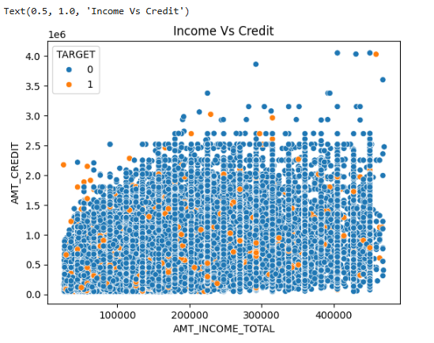
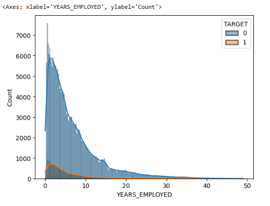
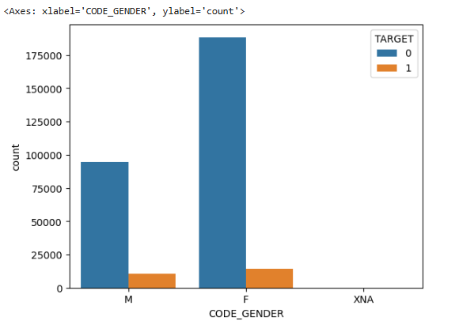

## Home Loan Default Prediction

### Problem Statement
This project aims to predict whether a loan applicant will default or not using machine learning techniques.

---

### Project Context
Banks and financial institutions face significant losses due to loan defaults. 
This project helps identify high-risk applicants in advance, enabling better decision-making.

---

### Dataset
The dataset contains customer financial, demographic, and credit history information.
The dataset is not included.

---

### Steps Performed
- Data Cleaning & Missing Value Handling
- Merging Multiple Tables (bureau, previous, credit, etc.)
- Feature Engineering
- Encoding & Scaling
- Handling Imbalanced Data
- Model Building (Logistic, RandomForest, LightGBM, XGBoost, AdaBoost, Gradient Boosting)
- Hyperparameter Tuning

---

### Sample Visualizations

#### Income vs Credit


#### Years Employed Distribution


#### Gender Count


---

### Models Used
- Logistic Regression
- Random Forest
- LightGBM
- XGBoost
- AdaBoost
- Gradient Boosting
---

### Performance
- Evaluation Metric: ROC-AUC
- Score Achieved: **~0.70**

---

### Key Insights
- Higher credit-to-income ratio increases default risk  
- External credit score (EXT_SOURCE_1) shows strong predictive power  
- Ensemble models (XGBoost, LightGBM) outperform baseline models  

---

### Tools & Libraries
- Python
- Pandas, NumPy
- Scikit-learn
- LightGBM, XGBoost
- Matplotlib, Seaborn

---

### Conclusion
- A machine learning pipeline was developed to predict loan default risk using real-world financial data. Ensemble models achieved better performance, and key financial indicators played a crucial role in prediction.

---

### Project Structure

```
HomeLoan_Default/
│── Home_Loan_Default.ipynb
│── README.md
│── images/
│   ├── 1.png
│   ├── 2.png
│   ├── 3.png
```
---